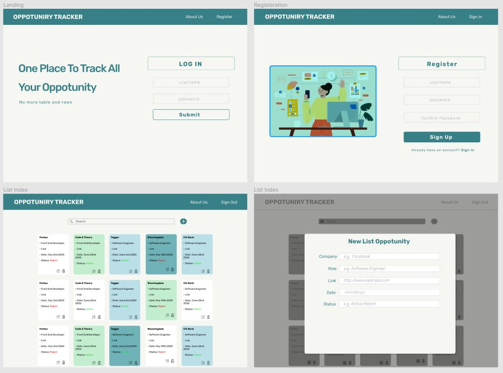

# OpTracker ( Oppotunity Tracker)

One place to track all your opportunities with a beautiful card UI.

## :chart_with_upwards_trend: Installation

Use the package manager [npm](https://www.npmjs.com/) to run OpTracker.

```bash
npm install
```

## :dart: Idea
- Use graphic design instead of table and row to list out your job/oppotunity 
- Display job/oppotunity in cards

## :computer: Usage 

- Add little flavor to job seeking process
- Enjoy beautiful card design instate of table,row and columns
- Simple and Easy to use


## Screenshot & Mockup design

[MOCKUP](https://www.figma.com/file/V98uR02cKJ5n5AkpJL6hpN/OpTracker?node-id=5%3A32)



## License
[KevinKarma](https://www.kevinkarma.com)